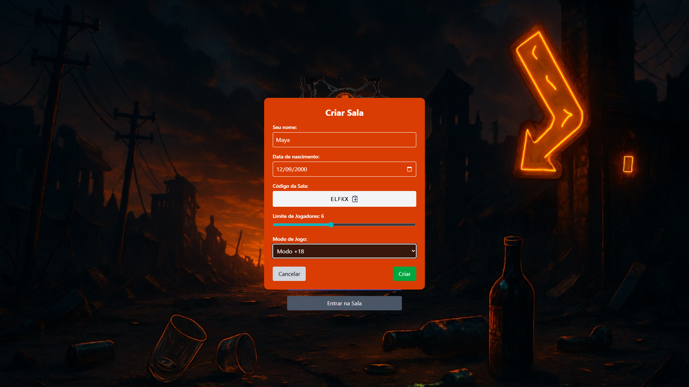
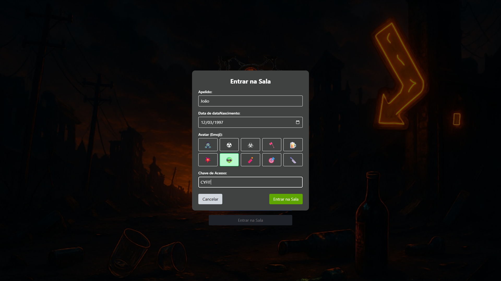
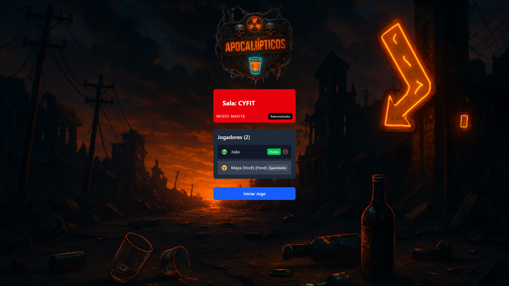

# 🧨 Apocalípticos - Drinking Game Online

**Apocalípticos** é um jogo interativo e insano para grupos de amigos (presencial ou remoto), inspirado em jogos como *Amigos de Merda*, *Verdade ou Desafio* e *Eu Nunca*. Com foco em desafios, perguntas e decisões bizarras em tempo real, tudo embrulhado em uma estética "apocalíptica zoada". Ideal para animar qualquer rolê!

### 📸 Telas do Jogo

| Tela Inicial | Criando uma Sala | Entrando em uma Sala | Lobby |
| :---: | :---: | :---: | :---: |
|  |  |  |  |

---

## 🚀 Tecnologias Utilizadas

- React + Vite
- TailwindCSS
- Firebase (Firestore, Auth)
- Shadcn/UI (componentes UI)
- Lucide Icons

---

## 🎮 Modos de Jogo

Os modos definem a intensidade e ousadia das cartas:

| Modo    | Descrição                                  |
|---------|---------------------------------------------|
| Normal  | Perguntas leves e desafios tranquilos       |
| +18     | Conteúdo adulto e provocante                |
| Difícil | Pesado, insano, para jogadores sem limites  |

---

## 🎲 Tipos de Cartas

Cada rodada traz um tipo de mini-jogo, com regras específicas:

| Tipo             | Nome             | Mecânica                                                                 |
|------------------|------------------|--------------------------------------------------------------------------|
| `verdadeDesafio` | Verdade ou Desafio | ADM escolhe o tipo antes da carta aparecer                              |
| `decisoes`       | Decisões de Merda | Jogador da vez enfrenta uma situação absurda + prenda                    |
| `votacao`        | Amigos de Merda   | Todos votam em alguém baseado na carta; o mais votado bebe              |
| `euNunca`        | Eu Nunca          | Quem já fez o que está na carta, bebe                                    |

---

## 📦 Estrutura do Firestore

- `/salas/{codigo}`
  - `modo`: string ("normal", "+18", "dificil")
  - `estado`: string ("lobby", "emAndamento", "finalizado")
  - `jogadorDaVez`: UID do jogador atual
- `/salas/{codigo}/jogadores`
  - `{uid}`: { nome, avatar, dataNascimento }
- `/cartas`
  - `{id}`:
    - `texto`: string
    - `tipo`: "verdadeDesafio" | "decisoes" | "votacao" | "euNunca"
    - `modosDisponiveis`: [ "normal", "+18", "dificil" ]

---

## 🧠 Lógica do Jogo

1. Jogadores entram com nome e data de nascimento.
2. ADM cria sala, define modo e inicia jogo.
3. Em cada rodada:
   - Jogador da vez é sorteado.
   - Tipo de jogo e carta são sorteados (de acordo com o modo).
   - A lógica da carta é executada (votação, desafio, etc).
4. Jogo segue até ADM finalizar.

---

## 📌 Funcionalidades Planejadas

- [x] Criação/entrada em sala com UID e código
- [x] Chat de lobby com avatares
- [x] Início manual pelo ADM
- [x] Sorteio aleatório de jogador da vez
- [ ] Interface dinâmica para cada tipo de carta
- [ ] Sistema de votação em tempo real
- [ ] Tela de "fim de jogo" com opção de reinício

---

## 🛠️ Como rodar localmente

```bash
git clone https://github.com/Emanuelsantos0318/Apocalipticos.git
cd apocalipticos
npm install
npm run dev
```

Configure as variáveis do Firebase em `.env.local`.

---

## 🍻 Contribuições

Ideias insanas de cartas? Pull requests? Bora!

---

## ⚠️ Aviso

Este jogo é para maiores de 18 anos. Beba com responsabilidade. Em breve um modo mais suave.

---

## 🧙‍♂️ Autor

Feito com caos por

| [<br><sub>Mateus Sanfer</sub>](https://github.com/MateusSanfer) | [<br><sub>Emanuel Santos</sub>](https://github.com/Emanuelsantos0318) |
| :---: | :---: |
